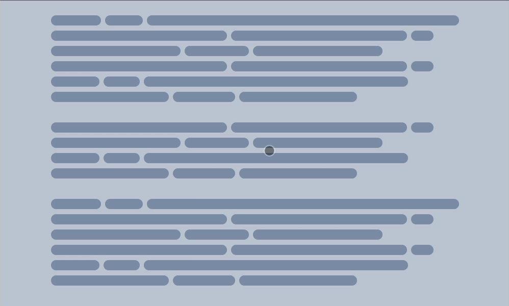

# Aat (Animate at) — [Demo built with it](https://codepen.io/tahazsh/full/WNYKage)

> Animate on scroll like a pro

**Aat** helps you create any scroll-based animation you can imagine (vertically and horizontally).

All you need to know is these two functions: `ScrollObserver.Container()` and `ScrollObserver.Element()`.

The first one is for animating based on the scroll position of a container (the default is the root element of the page). A popular example is updating a progress bar based on where you are on the page.

The second one is for animating based on the scroll position of a specific element in the viewport. For example, increase the size of the element as it moves from the bottom of the viewport to the top (it **moves** because you scroll down).

## Setup

You can install it using NPM:

```
npm install aatjs
```

Then import it:

```js
import { ScrollObserver } from 'aatjs'
```

Or include it as a <script> in your page:

```html
<script src="https://unpkg.com/aatjs/dist/aat.min.js"></script>
```

Then use it:

```js
const ScrollObserver = aat.ScrollObserver
```

## It just gives you the percentage

Animating on scroll is nothing more than updating the styling of an element based on the scroll position. The scroll position is represented as the percentage of where you are in the viewport.

For `ScrollObserver.Container()`, it gives you the percentage of where you are in the page (or a specific container). When you are at the very top, the percentage will be `0`. When you are the very bottom, the percentage will be `1`. This means that the value goes from `0` to `1`. For example, when you are at the middle of the page, it will be `0.5`.

For `ScrollObserver.Element()`, it gives you the percentage of where the element you specify is in the viewport. If the element is below the viewport, the value will be `0`. If the element is above the viewport, the value will be `1`. Once the element enters the viewport, the value will go from `0` to `1` based on the position.

**Note:** the position of the element in `ScrollObserver.Element()` is based on its left and top points. In other words, if the top `1px` of the element entered the viewport, the percentage value will be more than `0`.


## Examples

Let's take a look at some examples on how to use both functions.

### `ScrollObserver.Container(container?)`

In this example, we have a progress bar that we want to update based on the scroll position of the page.



HTML:

```html
<body>
  <div class="progress"></div>
  <div class="long-content"></div>
</body>
```

CSS:

```css
.progress {
  position: fixed;
  top: 0;
  left: 0;
  transform-origin: 0 0;
  background-color: red;
}
```

JS:

```js
import { ScrollObserver } from 'aatjs'

const progress = document.querySelector('.progress')

ScrollObserver.Container().onScroll(({ percentageY, percentageX }) => {
  progress.style.transform = `scaleX(${percentageY})`
})
```

**Note:** `percentageY` is for vertical scrolling and `percentageX` is for horizontal scrolling.

In this case, the container is the whole page. You can change it to specific container by passing it to the `Container` function.

```js
const section = document.querySelector('.section')
ScrollObserver.Container(section).onScroll(({ percentageY, percentageX }) => {})
```

### `ScrollObserver.Element(element, options)`

In this example, we have a box that we want to increase its opacity and size as we scroll.


HTML:

```html
<body>
  <div class="long-content"></div>

  <div class="box"></div>

  <div class="long-content"></div>
</body>
```

CSS:

```css
.box {
  opacity: 0;
  scale: 1;
  width: 100px;
  height: 100px;
  transform-origin: top center;
  background: red;
}
```

JS:

```js
import { ScrollObserver, valueAtPercentage } from 'aatjs'

const box = document.querySelector('.box')

ScrollObserver.Element(box).onScroll(({ percentageY, percentageX }) => {
  box.style.opacity = percentageY

  box.style.scale = valueAtPercentage({
    from: 1,
    to: 1.5,
    percentage: percentageY
  })
})
```

Since `opacity` is from `0` to `1`, we can use `percentageY` directly. However, for `scale`, we need it to range from `1` to `1.5`. We can achieve this with simple math, but to save you time, I have provided a helper function called `valueAtPercentage`.

`valueAtPercentage` takes an object with four properties:

- `from`: the initial value you want to animate from.
- `to`: the target value you want to animate to.
- `percentage`: the current scroll percentage value.
- `unit`: if your value has a unit like `px`, you can use this property. The default is an empty string.

## Change the container for the element

The default container for `ScrollObserver.Element()` is the root element of the page. If you want to use a different container, set the `container` option to what you want.

```js
const section = document.querySelector('.section')
ScrollObserver.Element(box, { container: section })
```

## Change the starting and end points for the element

The starting point is the point in the viewport where we initiate the animation when the element enters it. The default is at the very bottom of the viewport (which corresponds to percentage `0`).

The end point is the point in the viewport where the element reaches the final state of its animation. For example, if we are increase the opacity from `0` to `1`, it will be `1`. In other words, the percentage value will be `1`. The default is at the very top of the viewport.

That was for vertical scrolling. The same goes for horizontal scrolling. The starting point of the horizontal scrolling is at the very right of the viewport, and the end point is at the very left of the viewport.

You can update these values in the options using these properties:

- `offsetTop`: moves the end point down by the number provided in pixels.
- `offsetBottom`: moves the starting point up by the number provided in pixels.
- `offsetLeft`: moves the end point to the right by the number provided in pixels.
- `offsetRight`: moves the starting point to the left by the number provided in pixels.

For example:

```js
ScrollObserver.Element(box, {
  offsetTop: 10, // moves the end point down 10px (vertical scrolling)
  offsetBottom: 20, // moves the start point up 20px (vertical scrolling)
  offsetLeft: 10, // moves the end point to the right 10px (horizontal scrolling)
  offsetRight: 20 // moves the start point to the left 20px (horizontal scrolling)
})
```


